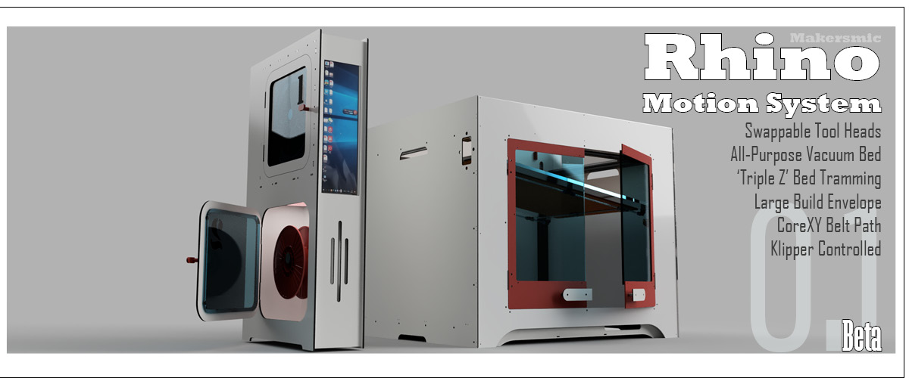
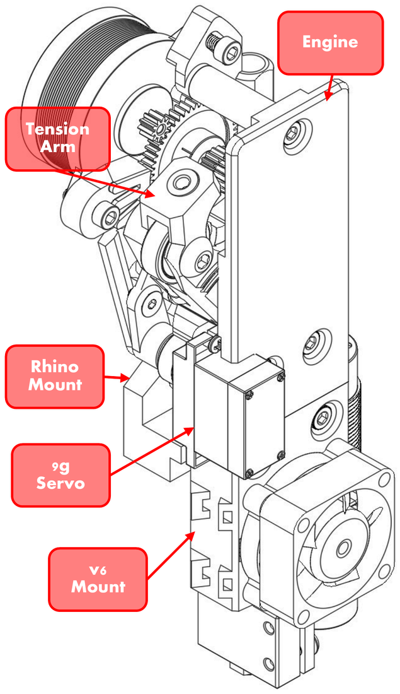
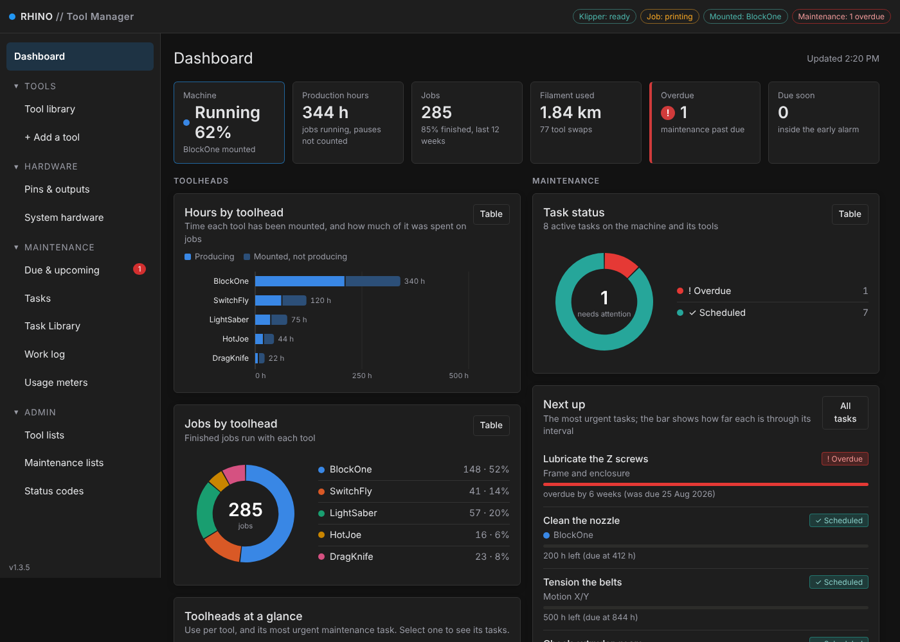
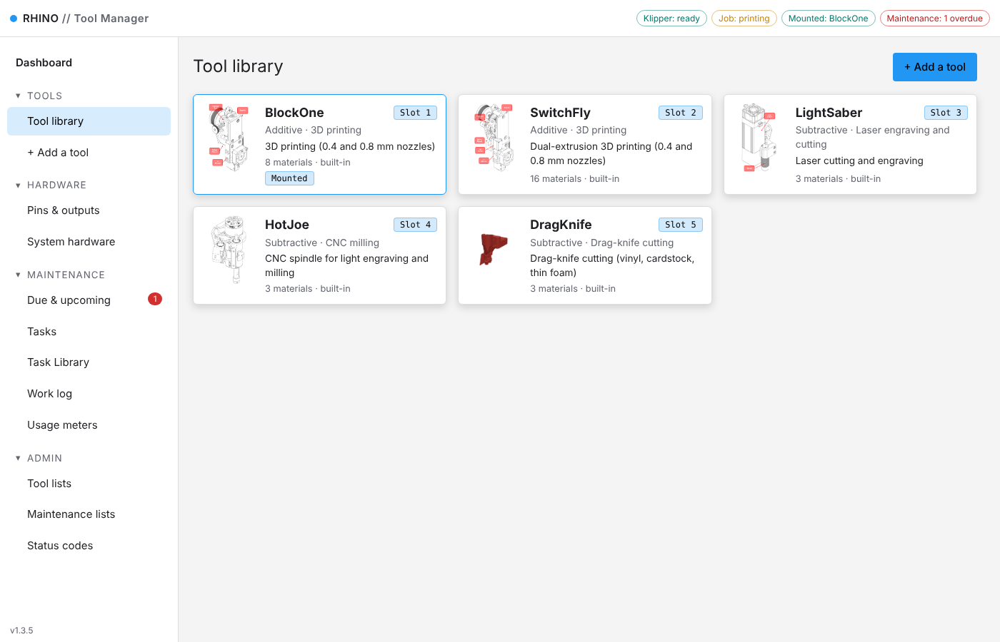
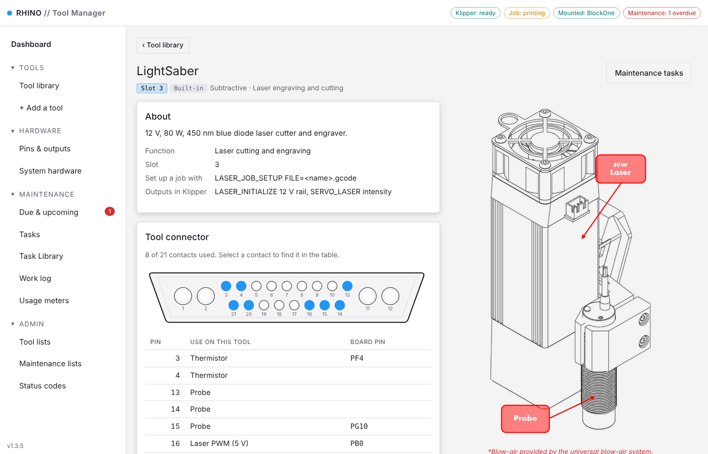
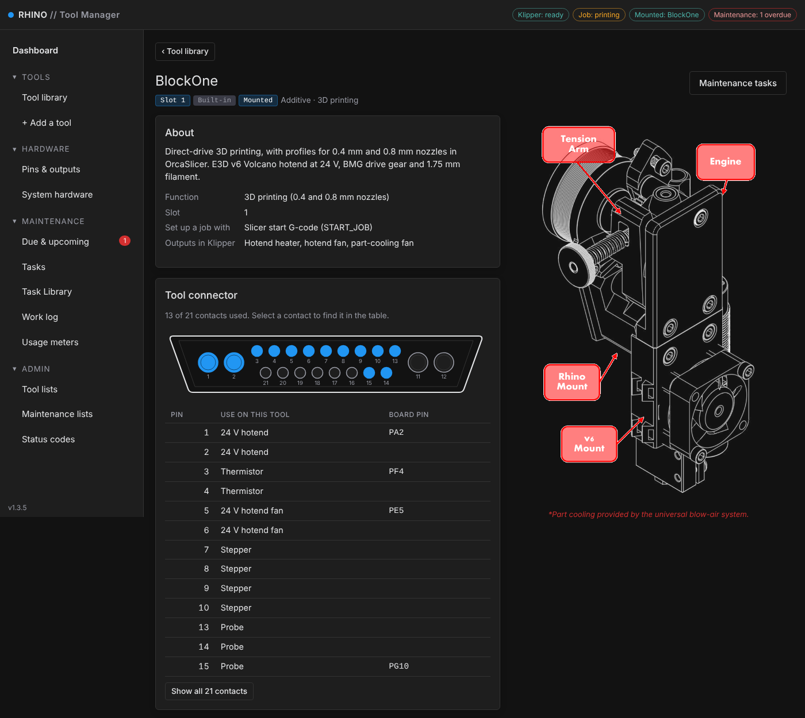
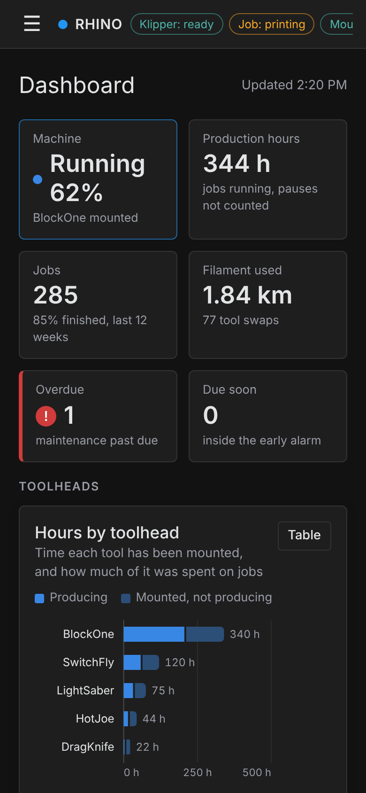
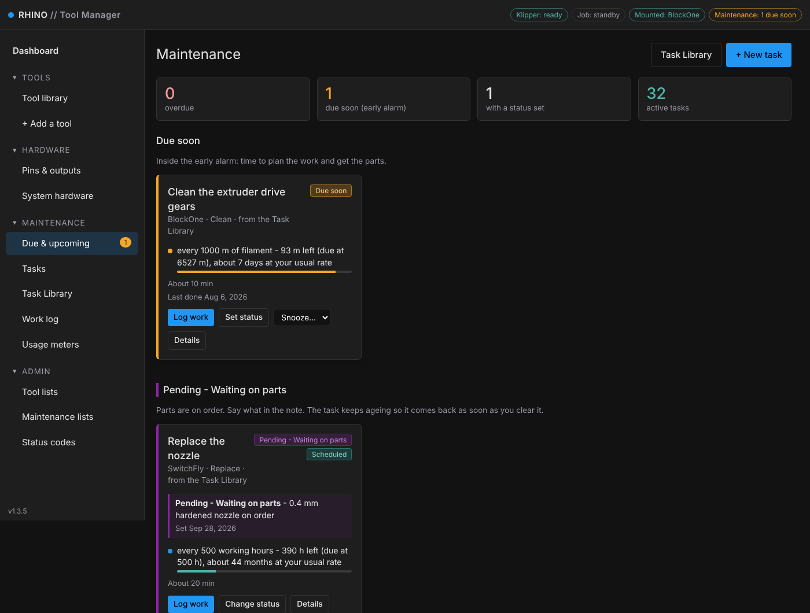

<p align="center">
  
</p>

<h1 align="center">Rhino Tool Manager</h1>

<p align="center">
  <b>One Klipper machine, five swappable toolheads - printing, laser, CNC and drag knife.</b><br>
  Safe tool swaps, a web portal for every tool, and maintenance tracking, all built on Klipper and Mainsail.
</p>

<p align="center">
  
  
  
  
  
</p>

## The toolheads

<table align="center"><tr><td align="center"><picture><source media="(prefers-color-scheme: dark)" srcset="rhino/portal/static/img/tools/blockone-dark.png"></picture></td><td align="center"><picture><source media="(prefers-color-scheme: dark)" srcset="rhino/portal/static/img/tools/switchfly-dark.png"></picture></td><td align="center"><picture><source media="(prefers-color-scheme: dark)" srcset="rhino/portal/static/img/tools/lightsaber-dark.png"></picture></td><td align="center"><picture><source media="(prefers-color-scheme: dark)" srcset="rhino/portal/static/img/tools/hotjoe-dark.png"></picture></td><td align="center"><picture><source media="(prefers-color-scheme: dark)" srcset="rhino/portal/static/img/tools/dragknife-dark.png"></picture></td></tr><tr><td align="center"><b>BlockOne</b><br><sub>3D printing</sub></td><td align="center"><b>SwitchFly</b><br><sub>Dual-extrusion printing</sub></td><td align="center"><b>LightSaber</b><br><sub>80 W laser</sub></td><td align="center"><b>HotJoe</b><br><sub>CNC spindle</sub></td><td align="center"><b>DragKnife</b><br><sub>Drag knife</sub></td></tr></table>

Rhino Klipper config for BTT Octopus v1.1, plus a tool-management package: add your own toolheads
(hot wire, needle cutter, other powered or passive tools, new nozzle sizes) from a web portal
with drop-down menus, typed names and photos - or from the console. Each tool can bring its own
extra controls (relays, fans, servos, switches - set up by describing what they do) and macros,
and the portal tracks preventive maintenance for the machine and every tool.

## The portal

A dashboard on port 5000 that follows Mainsail's light or dark theme and colour.



<sub>Toolhead hours and jobs on the left, maintenance on the right. [Full dashboard](docs/images/dashboard.png).</sub>

<table>
<tr>
<td width="50%"><b>Tool library</b><br>
<picture><source media="(prefers-color-scheme: dark)" srcset="docs/images/library.png"></picture></td>
<td width="50%"><b>Each tool's own page</b>: connector and pins, materials, macros<br>
</td>
</tr>
<tr>
<td><b>Pin map for every tool</b><br></td>
<td align="center"><b>Works on a phone</b><br></td>
</tr>
</table>

## Maintenance at a glance

<a href="docs/maintenance/"></a>

<sub>A year of maintenance on the Rhino: what's due, what's on hold for parts and what's coming up.
<a href="docs/maintenance/">See the full maintenance showcase &rarr;</a></sub>

## What's in it

| | |
|---|---|
| 🔁 **Safe tool swaps** | `SWAP_TOOL` parks the bed at a safe height, homes X/Y only, and won't home Z with a laser, spindle or knife mounted |
| 🧾 **Job guard** | A sliced file says which tool it needs; the job stops if a different tool is mounted |
| 🌡️ **Print start** | Tool-and-material check, preheat, prime line and pressure advance before the file runs |
| 📏 **Paper-test Z** | `NOZZLE_HEIGHT_CALIBRATE` - a Mainsail button for setting nozzle height |
| 🛠️ **Add your own tools** | Hot wire, needle cutter or any powered or passive tool, from the portal with photos |
| 🧰 **Maintenance** | Tasks by hours, jobs, swaps or calendar, for the machine and every tool, with a work log - [see it in action](docs/maintenance/) |
| 🖨️ **OrcaSlicer profiles** | BlockOne printer, process, PLA and PETG in `slicer/orca/` |
| 📦 **Menu installer** | KIAUH-style menu: preview, install, update from a zip, undo from a backup |
| 📘 **User manual** | `manual/Rhino-User-Manual.pdf` - install, every tool, wiring and maintenance |

## Install

Full step-by-step guide: the "Install and first start" chapter of the user manual
(`manual/Rhino-User-Manual.pdf`). Short version, using the menu installer:

1. Upload `rhino-config-<version>.zip` in Mainsail (**Machine** > **Upload**). It lands in `~/printer_data/config/`.
2. On the Pi (SSH), open the menu:
   - first time: unzip to a side folder, then `bash ~/rhino-<version>/rhino.sh`
   - afterwards: `bash ~/rhino-manager/rhino.sh`
3. Choose **3) Install a new zip**, pick the zip, read the preview, and confirm.
   The installer checks the Pi first, backs up your config folder to `~/rhino-backup-<date>`, copies the files
   (never `variables.cfg` / `variables.save`, `dev/`, or your generated `custom_tools.cfg` / `maintenance_status.cfg`),
   carries over your SAVE_CONFIG section and starts the `rhino-portal` service on port 5000.
4. In Mainsail, **with a print head mounted**: `FIRMWARE_RESTART`, answer the tool question, `CHECK_TOOLHEADS`.

Undo: menu option **4) Undo an install** and pick a backup.

## Repository layout

- Config package (what the zip contains): the `.cfg` files, `rhino/` (portal), `scripts/`, `service/`, `tools/`,
  `toolheads/`, `guided/`, `myrhino/`, `slicer/orca/` (OrcaSlicer profiles), `dev/` (tests: `bash dev/run_all.sh`).
- `manual/`: the user manual - `Rhino-User-Manual.pdf`, its sources (`src/`, `img/`) and build scripts.

## Dashboard and colours

The portal opens on a **Dashboard**: toolhead use (hours, jobs, jobs per week) beside maintenance (task status,
what is next, tasks per machine and tool, work logged per week). Each chart has a **Table** button. The portal
follows Mainsail's dark/light mode and primary colour (Mainsail: Settings > UI-Settings); nothing to set here.

## Adding a tool

Portal: **Add a tool** -> Additive, Subtractive or Passive, then the kind -> name it -> **Outputs**: one row
per output (main power level, or switch on with the tool), each picked by umbilical contact, a spare pin
or system hardware, plus the contacts the tool uses -> limits -> materials and checklist -> controls ->
macros -> review (checked against your live config) -> create. Then press **Restart Klipper** (refused
while a job is running). The kinds, material names and nozzle sizes the drop-downs offer are edited under
**Admin > Tool lists**.

Console equivalent:
```
ADD_TOOLHEAD NAME=FoamWire KIND=HOT_WIRE PIN=PB1
ADD_TOOLHEAD NAME=Needle KIND=NEEDLE POWER_PIN=SPINDLE_SPEED
ADD_TOOLHEAD NAME=Wide KIND=PRINT_HEAD BASE=BlockOne NOZZLES=0.6,1.0
SET_TOOLHEAD TOOLHEAD=FoamWire MATERIAL=FOAM_EPS
TOOL_JOB_SETUP FILE=cut.gcode
```

## Controls and macros for a tool

The add wizard has **Controls** and **Macros** steps, and the edit window has tabs for both.
- **Controls**: press **+ Add a control**, name it, and answer what it does - Rhino switches it on/off,
  sets a level, runs it like a fan, runs it while a heater is hot, moves a servo, or the tool sends a signal
  in (button, lid switch, sensor). The portal picks the Klipper section (`output_pin`, `fan_generic`,
  `heater_fan`, `servo`, `gcode_button`), offers only free connector pins that can do the job, and shows
  the exact text it will write. Optional: switch it off whenever the machine is made safe, and generate
  `NAME_ON` / `NAME_OFF` (or `_SET` / `_ANGLE`) macros that only work while the tool is mounted.
- **Macros**: **+ Add a macro** -> name, purpose, body. The preview under the editor is exactly what goes
  into `custom_tools.cfg`; names that clash with any macro or Klipper command and template errors are
  refused before saving.
- Describe your connector pins in `myrhino/umbilical.json` (`{"pin": "PB1", "type": "logic"}` or
  `"type": "mosfet"`) so the guide can keep inputs and servos off switched power outputs.

## Pause and resume

Print jobs pause and resume with Mainsail's buttons as usual. Laser, CNC, drag-knife and added-tool jobs
pause with Mainsail's Pause (the head lifts 10 mm and the tool switches off), then resume with the
**Resume job** button in the pop-up that appears, or `TOOL_RESUME`. Mainsail's Resume refuses those jobs
because the extruder is cold. Rhino's additions to PAUSE / RESUME / CANCEL_PRINT go through Mainsail's
`_CLIENT_VARIABLE` hooks in `client_macros.cfg`; `mainsail.cfg` itself is never edited.

## System hardware

**Hardware > System hardware** adds things on board pins that are not on the umbilical - enclosure fans and
lights, an air or vacuum pump, a door switch, a sensor - with the same guided set-up as a tool control. It
works whatever tool is mounted; a powered tool can switch a piece of it on with itself (a vacuum that runs
with a cutter). **Pins & outputs** shows all 21 contacts of the tool connector, the board pin behind each,
what drives it and which tools use it; describe your own wiring with `"contacts"` in `myrhino/umbilical.json`.

## Restart banner

Tool changes are saved at once and loaded at the next Klipper restart. The yellow banner lists what is
waiting. During a job it shows the file, progress, elapsed and remaining time (slicer estimate for prints,
file progress for laser/CNC files), when a restart becomes possible, and how long a pause has lasted.
Tick **Restart automatically when this job finishes** to have the portal restart Klipper 30 s after a job
completes or is cancelled (never after an error). A restart started anywhere else also clears the banner.

## Preventive maintenance

Sidebar **Maintenance**: *Due & upcoming*, *Tasks*, *Task Library*, *Work log*, *Usage meters*.
- Start in the **Task Library**: assign a **Task Book** (a named group of library tasks) to the whole machine
  and to each tool. The tasks it adds stay linked to the library - edit a library task once and every copy
  follows. Starter books cover the Rhino and each tool type; make your own with **+ Task Book**.
- **Status codes** (Admin > Status codes): set "Pending - Waiting on parts" and the like on a task, from its
  card or the **Log work** list. Each code has rules: where the task is listed, whether its clock keeps
  running, pauses or counts as done, when it ends by itself, whether it stays in the Mainsail reminder and
  whether a note is required.
- A task has up to four rules, whichever comes first: every N days/weeks/months (from last done, or on a
  fixed calendar), every N of a usage meter, after each event (tool swap, tool mounted, job, emergency stop),
  or once on a date. Each rule has an **early alarm** - how long before due it turns *Due soon* and lists
  the parts to have ready.
- Meters: machine up hours (Klipper ready), production hours (a job running, pauses not counted), jobs,
  filament, tool swaps, shutdowns; per tool: hours mounted, production hours, working hours (nozzle
  heater on / laser on / spindle running / output on), jobs, mounts, filament. Jobs that ran while the
  portal was down are filled in from Moonraker's history. **Set** a reading if the machine had hours before.
- Nothing is ever blocked. After a Klipper start, overdue and due-soon tasks are shown once in a Mainsail
  prompt (after the "which tool is mounted?" question); `PM_STATUS` lists them in the console any time.
- Files: `myrhino/maintenance/tasks.json`, `history.json`, `meters.json` (inside the config folder, so
  klipper-backup keeps them) and the generated `myrhino/maintenance_status.cfg`.

## Where things are (so you can change one thing without reading everything)

| To change... | Edit |
|---|---|
| default power caps, materials, checklists, allowed characters, limits | `rhino/presets.py` |
| which pins reach the tool connector | `myrhino/umbilical.json` (copy `umbilical.example.json`) |
| validation rules (what is refused, and the message) | `rhino/builders.py` |
| how the config is scanned for used pins | `rhino/klipper_cfg.py` |
| the generated Klipper file / JSON saving / backups | `rhino/registry.py` |
| add / edit / remove behaviour | `rhino/service.py` |
| console output | `rhino/cli.py` |
| web endpoints and security | `rhino/portal/routes.py`, `security.py`, `media.py` |
| portal screens (wizard, editor, controls, macros) | `rhino/portal/static/portal.js`, `templates/index.html`, `portal.css` |
| control and macro rules / the Klipper text they become | `rhino/extras.py` / `rhino/sections.py` |
| maintenance schedules, meters, starter tasks | `rhino/maint/schedule.py`, `meters.py`, `library.py`, `service.py` |
| maintenance screens | `rhino/portal/static/maint.js`, `rhino/portal/maint_routes.py` |
| Admin screens (drop-down lists, status codes) | `rhino/portal/static/admin.js`, `rhino/lists.py` |
| the 21 umbilical contacts, board-header labels | `rhino/presets.py` (`DEFAULT_CONTACTS`, `BOARD_HEADERS`) or `myrhino/umbilical.json` |
| the start-up maintenance prompt, `PM_STATUS` | `guided/maintenance.cfg` |
| job timer, auto-restart, meter polling | `rhino/monitor.py` |
| M3/M4/M5, power cap, watchdog, safe-off | `tools/tool_power.cfg` |
| console commands ADD_/EDIT_/REMOVE_TOOLHEAD | `guided/add_toolhead.cfg` |
| guided job setup for custom tools | `guided/generic_workflow.cfg` |

Data: `myrhino/custom_tools.json` (source of truth; last 10 versions kept in `myrhino/registry_backups/`),
`myrhino/custom_tools.cfg` (generated, do not edit), photos in `~/printer_data/rhino_data/images/`
(outside the config folder, so backups stay small).

## Tests

`sh dev/run_all.sh` runs the static lint, 95 simulated-Klipper macro checks (against the real Mainsail macros in `dev/fixtures/mainsail.cfg`), 44 portal checks, 45 checks
for controls / macros / the restart banner, 60 maintenance checks and 72 checks for 1.2 (categories, contacts,
system hardware, status codes, Task Books) (needs `pip install jinja2 flask`).
`python3 dev/demo_server.py` runs the portal against a copy of the config and a fake Moonraker, so you can
try every screen without the printer. The simulator reproduces Klipper's template rules; it is not Klipper,
so test new tools on the real machine with the tool powered from a current-limited supply first.

## Security notes

The portal has no login: anyone who can reach port 5000 can add or remove tools (not run G-code or restart
mid-print). Keep it on your LAN, or use `--host 127.0.0.1` and an SSH tunnel. Other websites cannot drive it
(per-start token, same-origin check, strict Content-Security-Policy, no inline script, no external files).

## Things to check on the machine (see CHANGES.md)

The first `SET_Z_ZERO` after a restart (the Bed position question), `COOLDOWN.cfg` needs `[idle_timeout] timeout: 1800` for
the full ABS/ASA ramp, and most of the pins on your original portal whitelist are already used.
