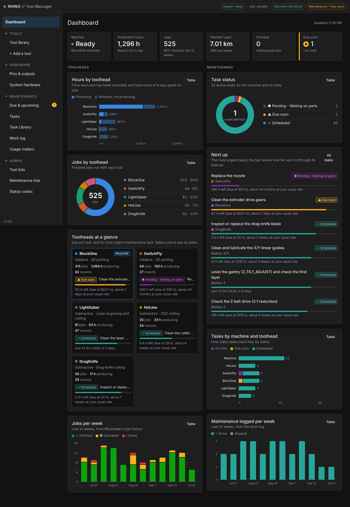
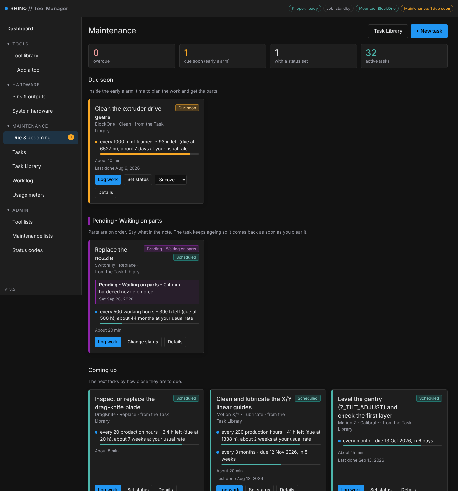
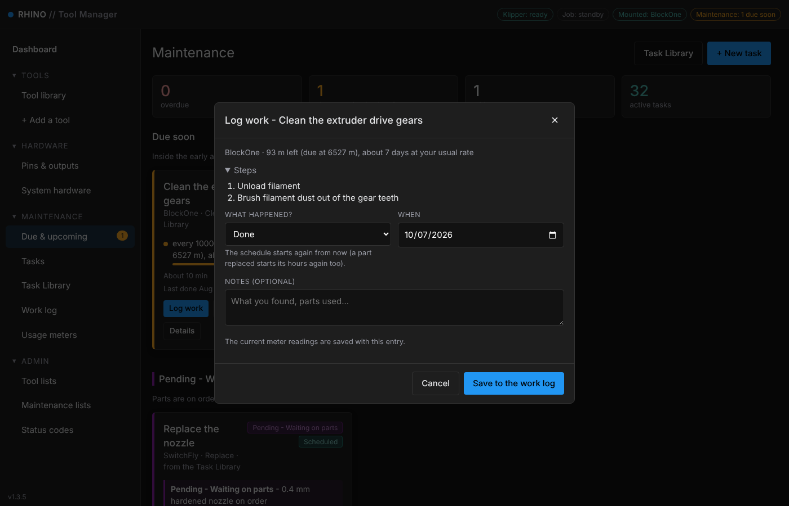
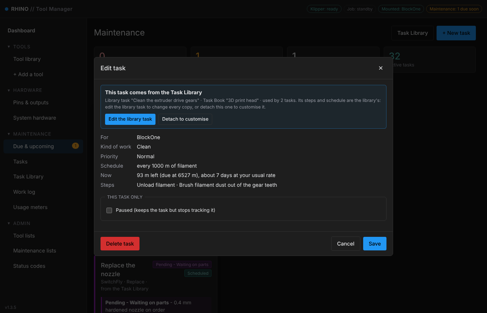
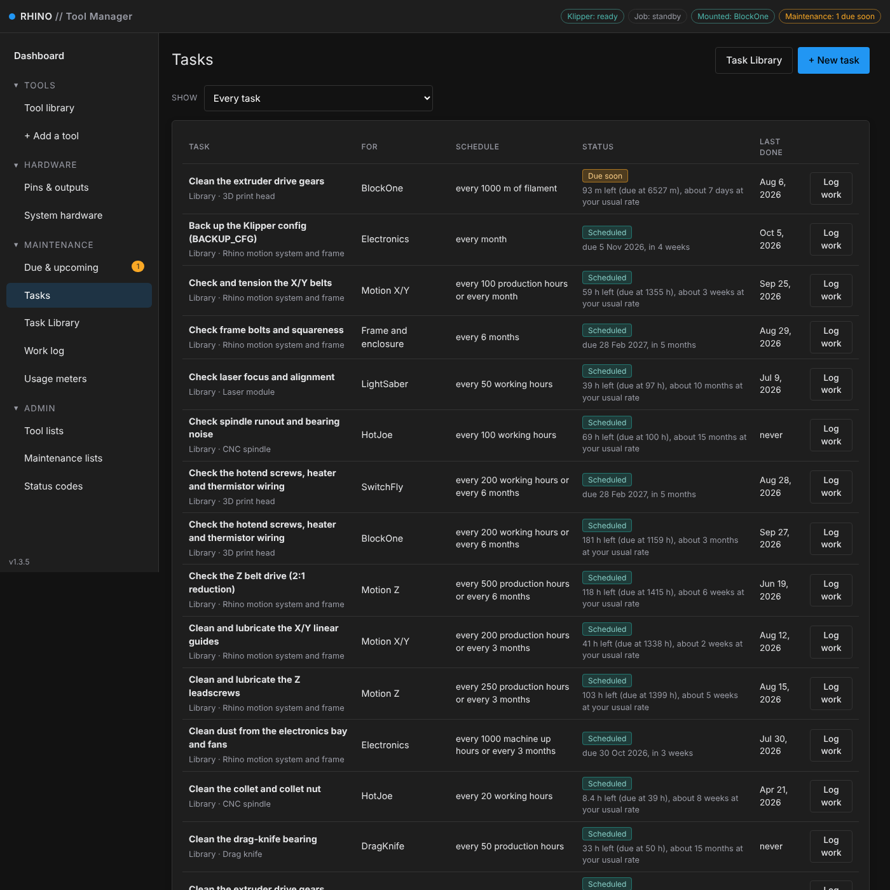
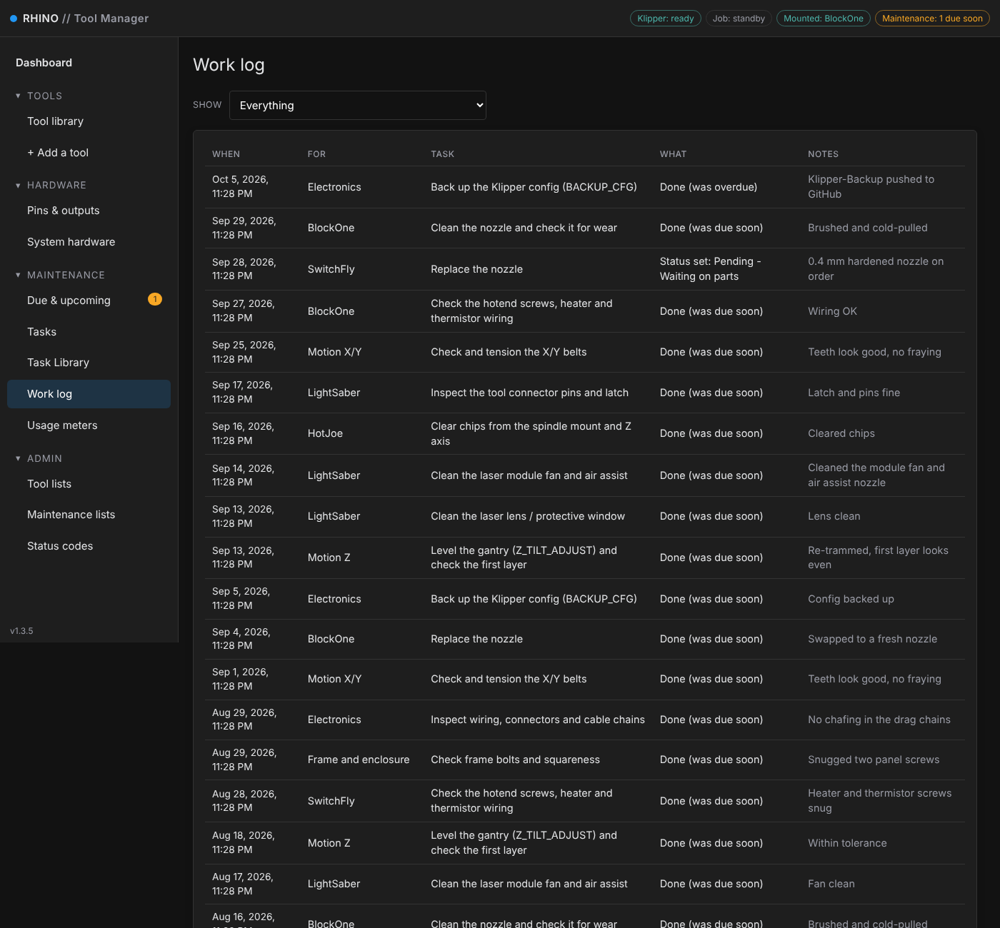
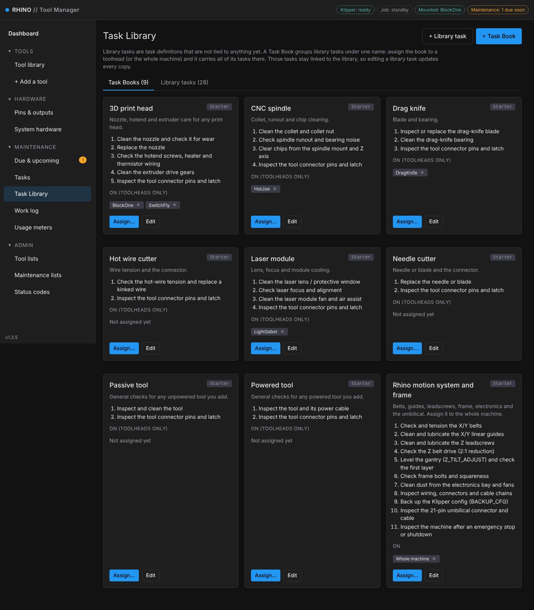
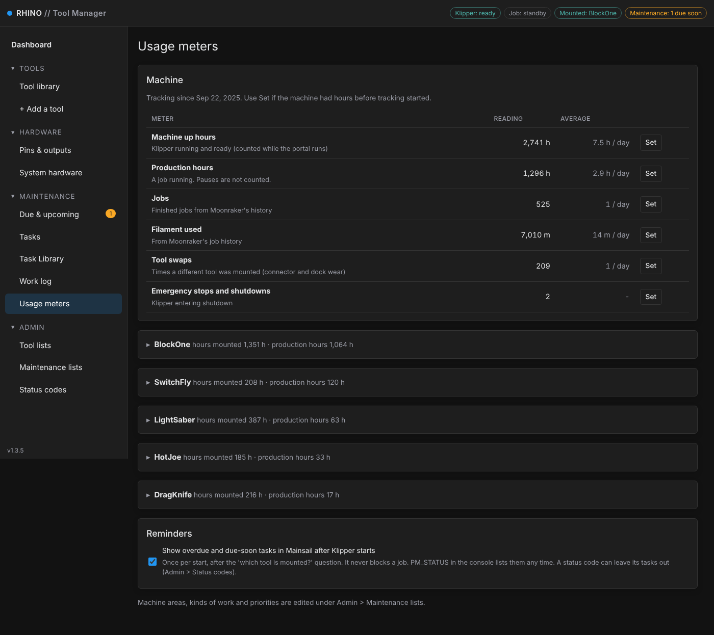
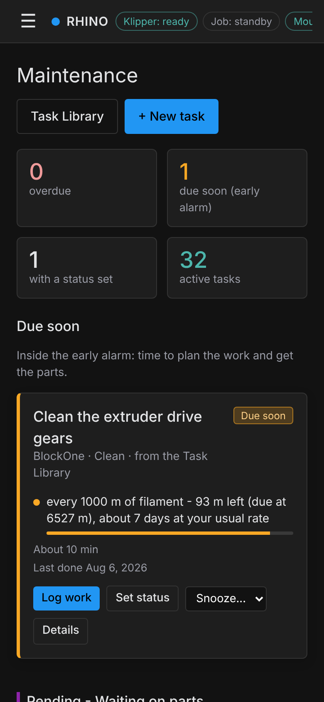

# Preventive maintenance

The Tool Manager portal keeps the Rhino - and every toolhead - on a maintenance schedule. It counts real use from
Klipper and Moonraker (production hours, jobs, filament, tool swaps, laser and spindle working hours), tells you what's
coming due before it's due, and keeps a work log of everything that was done.

> These screenshots show a machine after about a year of use with the built-in Task Books assigned on day one:
> 525 jobs, 1,296 production hours, 209 tool swaps and 122 work-log entries.

The dashboard gives maintenance equal billing with the toolheads: task status, the most urgent tasks, tasks per
machine area and toolhead, and work logged per week.

## Due & upcoming

Everything that needs attention, most urgent first. Each card shows how far through its interval a task is, and turns
that into days at **your** usual rate of use ("93 m left, about 7 days at your usual rate").

- **Due soon** - inside the early alarm: time to plan the work and order parts.
- **Overdue** - past the due point. Nothing is blocked; fit it in when it suits you.
- **Status codes** - put a task on hold with a reason, like *Pending - Waiting on parts*. It keeps ageing, so it comes
  back as soon as you clear it.

## Logging work

One click from any card. Pick what happened (done, skipped, or one of your own status codes), the date and a note.
The current meter readings are saved with the entry, and the schedule restarts from there.

<table>
<tr>
<td width="50%"></td>
<td width="50%"></td>
</tr>
<tr>
<td>Log work: steps, what happened, when, notes</td>
<td>A task from the Task Library: edit the library task once and every copy follows</td>
</tr>
</table>

## Schedules that follow real use

A task can run on any of these, or several at once - whichever comes first wins:

| Counts | Examples |
|---|---|
| Machine production hours, up hours, jobs, filament, tool swaps | X/Y belts every 100 production hours, umbilical every 100 swaps |
| A toolhead's own working hours, jobs, filament or mounts | Laser lens every 10 laser hours, drag-knife blade every 20 hours, collet every 20 spindle hours |
| Calendar time | Z_TILT_ADJUST every month, frame bolts every 6 months |
| Events | Inspect the machine after an emergency stop or shutdown |

## Work log

Every job done, skipped or put on hold, with the date, what it was for, what state it was in and your notes - a
service history for the whole machine.

## Task Library and Task Books

Starter Task Books for the Rhino's motion system and frame, print heads, the laser, the spindle and the drag knife, plus
books for tools you add (hot wire, needle cutter, powered or passive tools). Assign a book to a toolhead or the whole
machine and all of its tasks are set up at once.

## Usage meters

What the schedules count, with the average per day. Readings come from Klipper and Moonraker automatically; **Set**
corrects one if the machine had hours before tracking started.

## Reminders in Mainsail and on your phone

Overdue and due-soon tasks are shown once in Mainsail after each Klipper start (and any time with `PM_STATUS`), and the
portal works on a phone - handy with Tailscale when you're away from the shop.

## More

- The user manual (`manual/Rhino-User-Manual.pdf`), **Part 4 · Maintenance**: maintenance tracking, the Task Library,
  status codes and the maintenance procedures themselves.
- Code: `rhino/maint/` (schedules, meters, the starter library) and `rhino/portal/static/maint.js`.
- These screenshots were made with `dev/maint_year_demo.py`, which runs the real maintenance code on a simulated
  year of use.
